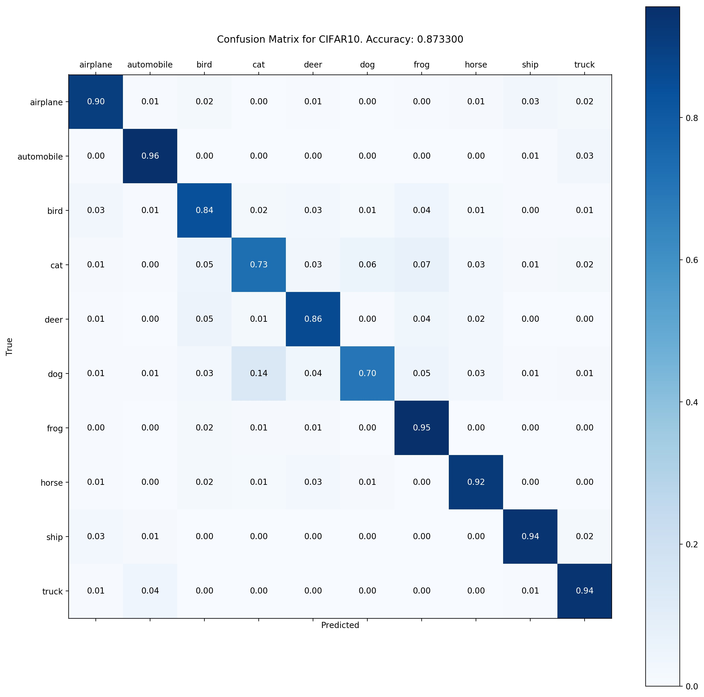

# Classification-AutoEncoder

The aim of this project is to train an autoencoder network, then use its trained weights as initialization to improve classification accuracy with cifar10 dataset. This is a kind of [transfer learning](http://cs231n.github.io/transfer-learning/) where we have pretrained models using the unsupervised learning approach of auto-encoders. Final classification model achieved accuracy of 87.33%.

## How to run

Download and prepare cifar10 dataset:
```Shell
  cd data/
  ./gen_cifar10.sh
  ```
  This script will download cifar10 dataset, then split it to folders as needed for Keras `flow_from_directory()` function. The Autoencoder and Classification scripts here can work with any dataset, just remember to set input image size, number of classes, .. etc to match your data. 
  
### Train Auto-encoder network 
To train the autoencoder, just run `python Train_Autoencoder.py`, or you can download the trained model from [here](models/ae_cifar10/)  <br />

The autoencoder network in this project is trained to be an initialization for the classification network. If you want to get better output images, consider removing the fully connected layer. 


### Train Classification network

To start training the classifier, run `python Train_Classifier.py`, or you can download the trained model from [here](models/cls_cifar10/)

### Classification model evaluation

Finally, run `python Evaluate_Classifier_cifar10.py` to evaluate the trained classification model. <br />

The model accuracy is 87.33%, and the confusion matrix is shown below. <br /> 




The evaluation script here is done for cifar10 dataset, but it can be easily modified to work with any dataset you have. <br /> 

## Requirements

1. Python 3
2. Keras with tensorflow. The scripts here are developed using Tensorflow version 1.9, but it is expected to work with newer version of tensorflow 1.xx

Have fun ^_^ 
